<picture><source media="(prefers-color-scheme: dark)" srcset="./assets/city-dark.svg"></picture>

<b>Full stack engineer</b> building production web apps with Next.js and Node.js, and wiring LLMs into them — Claude, OpenAI, LangChain and RAG. Full Stack Web Developer at BitzSol, Islamabad · freelancing for clients in 3 countries.

 
<h3><code>hasnain@city ~ $ whoami</code></h3>

<picture><source media="(prefers-color-scheme: dark)" srcset="./assets/portrait-dark.svg"></picture>
<picture><source media="(prefers-color-scheme: dark)" srcset="./assets/card-dark.svg"></picture>

<h3><code>hasnain@city ~ $ ./contact.sh</code></h3>

<a href="https://has-nain.dev"><picture><source media="(prefers-color-scheme: dark)" srcset="./assets/contact-portfolio-dark.svg"></picture></a>
<a href="https://linkedin.com/in/hasnainaftab"><picture><source media="(prefers-color-scheme: dark)" srcset="./assets/contact-linkedin-dark.svg"></picture></a>
<a href="mailto:contact@has-nain.dev"><picture><source media="(prefers-color-scheme: dark)" srcset="./assets/contact-email-dark.svg"></picture></a>
<a href="https://drive.google.com/file/d/1nRNyTThlNpX6LQX5nNEKfYHSsv71wsxT/view?usp=sharing"><picture><source media="(prefers-color-scheme: dark)" srcset="./assets/contact-resume-dark.svg"></picture></a>

 

<h3><code>hasnain@city ~ $ ls ./projects</code></h3>

<a href="https://github.com/hasnain833/ai4home-portal"><picture><source media="(prefers-color-scheme: dark)" srcset="./assets/project-ai4home-dark.svg"></picture></a>
<a href="https://github.com/hasnain833/Splunk_middleware"><picture><source media="(prefers-color-scheme: dark)" srcset="./assets/project-security-dark.svg"></picture></a>
<a href="https://github.com/hasnain833/cesarEnrichFlow"><picture><source media="(prefers-color-scheme: dark)" srcset="./assets/project-enrichflow-dark.svg"></picture></a>
<a href="https://github.com/hasnain833/pocketpinky"><picture><source media="(prefers-color-scheme: dark)" srcset="./assets/project-pocketpinky-dark.svg"></picture></a>
<a href="https://has-nain.dev"><picture><source media="(prefers-color-scheme: dark)" srcset="./assets/project-habibi-dark.svg"></picture></a>
<a href="https://has-nain.dev"><picture><source media="(prefers-color-scheme: dark)" srcset="./assets/project-turo-dark.svg"></picture></a>
<a href="https://has-nain.dev"><picture><source media="(prefers-color-scheme: dark)" srcset="./assets/project-calmbot-dark.svg"></picture></a>
<a href="https://github.com/hasnain833/MediTrack_DotNet"><picture><source media="(prefers-color-scheme: dark)" srcset="./assets/project-meditrack-dark.svg"></picture></a>

 

<h3><code>hasnain@city ~ $ cat stack.txt</code></h3>

<picture><source media="(prefers-color-scheme: dark)" srcset="./assets/stack-dark.svg"></picture>

 

<h3><code>hasnain@city ~ $ history</code></h3>

<picture><source media="(prefers-color-scheme: dark)" srcset="./assets/history-dark.svg"></picture>

<b>Certifications and languages</b>

 

**Certifications:** React.js (Udemy) · JavaScript Algorithms and Data Structures (freeCodeCamp) · MERN Stack Development (Coursera) 
**Languages:** English · Urdu · Punjabi

 

<code>hasnain@city ~ $ exit</code> 
Open to onsite roles in Islamabad, Rawalpindi, Lahore and Karachi · <a href="mailto:contact@has-nain.dev">contact@has-nain.dev</a> · the city above rebuilds itself every day from my real contributions

