<h3><code>hasnain@github ~ $ whoami</code></h3>

<table>
  <tr>
    <td valign="top"></td>
    <td valign="top"></td>
  </tr>
</table>

 

<h3><code>hasnain@github ~ $ ls ./projects</code></h3>

| Project | Stack | What it does |
|---|---|---|
| 🏠 **[AI4Home Warranty Portal](https://github.com/hasnain833/ai4home-portal)** | Next.js · Express · Prisma · PostgreSQL · Claude API · pgvector | Multi-tenant SaaS for home builders — AI sales agents, semantic search, Salesforce / Google Calendar / Twilio integrations |
| 🔐 **[AI Security Suite](https://github.com/hasnain833/Splunk_middleware)** | Python · LangChain · Chroma · FAISS · Splunk | RAG-based malware & phishing detection middleware for Splunk |
| 📈 **[EnrichFlow](https://github.com/hasnain833/cesarEnrichFlow)** | Next.js · Supabase · Prisma · n8n | Automates Apollo-based contact enrichment across multiple data providers |
| 💝 **[Pocket Pinky](https://github.com/hasnain833/pocketpinky)** | React Native · Node.js | AI dating coach with a conversational UI |
| 🛒 **Habibi Market** | MERN · Tailwind · JWT · Stripe | E-commerce platform — 400+ listings, real-time chat, payments |
| 🚗 **Turo** | Next.js · Node.js · MongoDB | Vehicle rental platform — car, airplane & boat bookings |
| 🤖 **CalmBot** | Python · LangChain · OpenAI · FAISS | CBT therapy assistant with a RAG pipeline & mood tracking |
| 💊 **[MediTrack](https://github.com/hasnain833/MediTrack_DotNet)** | C# · .NET · WPF | Desktop pharmacy management system with an auto-updater |

 

<h3><code>hasnain@github ~ $ cat stack.txt</code></h3>

   
  

**AI / LLM:** Claude API · OpenAI API · LangChain · RAG pipelines · pgvector · FAISS · Chroma
&nbsp;·&nbsp; **Also:** React Native · .NET / C# · PHP / Laravel

<b>Experience, education & certifications</b>

 

| Role | Company | Duration |
|---|---|---|
| Full Stack Web Developer | BitzSol, Islamabad | Aug 2025 – Present |
| Full Stack Developer (Freelance) | Remote — clients in 3 countries | Jul 2023 – Present |
| Frontend Developer | CafeVista, Islamabad | Jan 2022 – Jul 2023 |

**Education:** BS Information Technology — NUML Islamabad (2022 – 2026)
**Certifications:** React.js (Udemy) · JavaScript Algorithms & Data Structures (freeCodeCamp) · MERN Stack Development (Coursera)
**Languages:** English · Urdu · Punjabi

